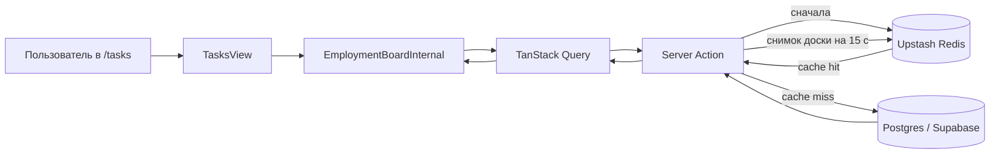
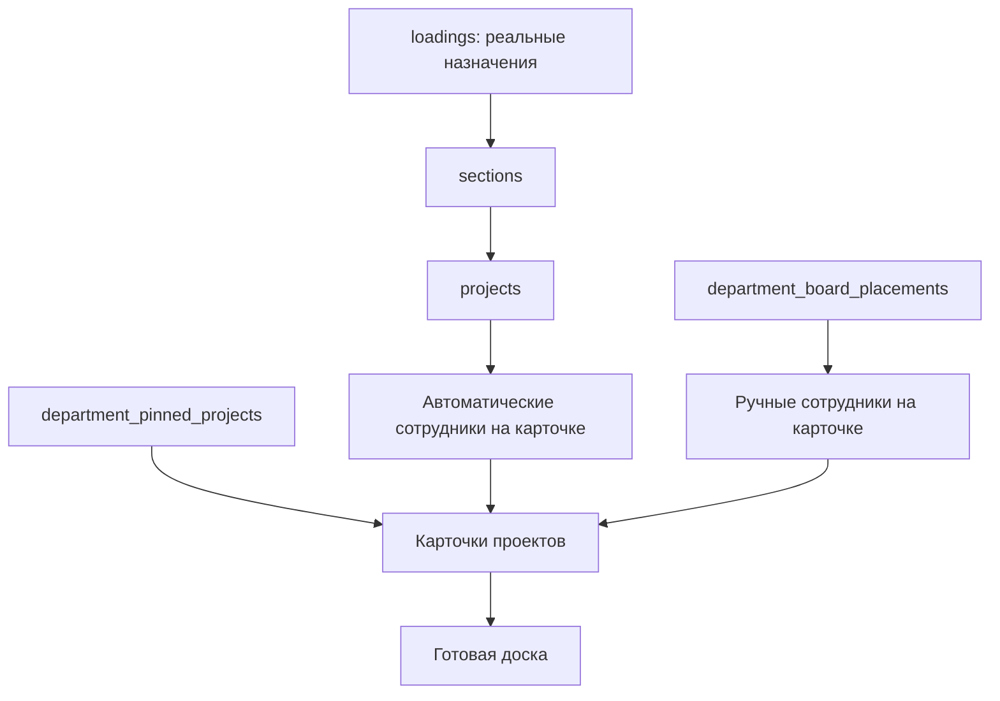
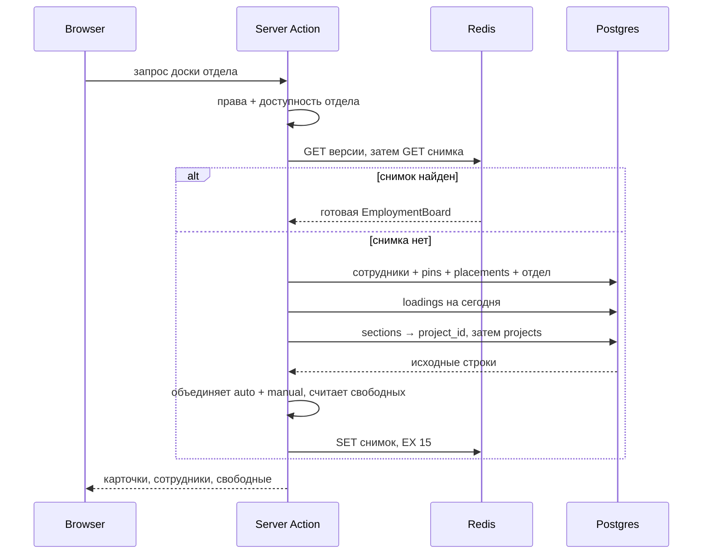
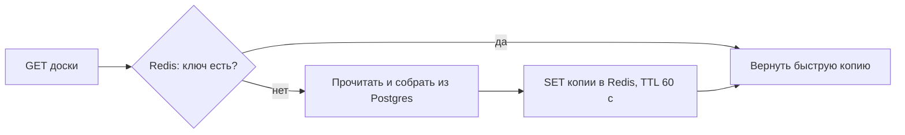
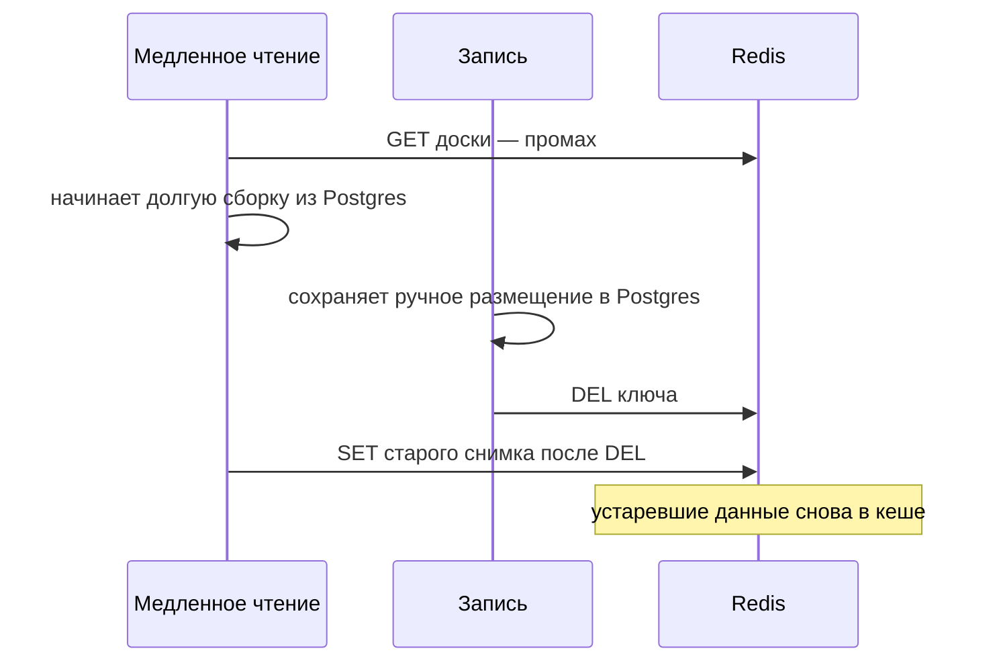
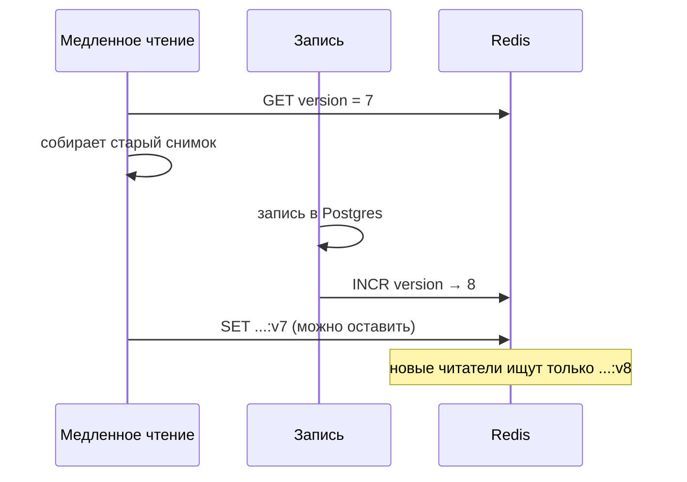
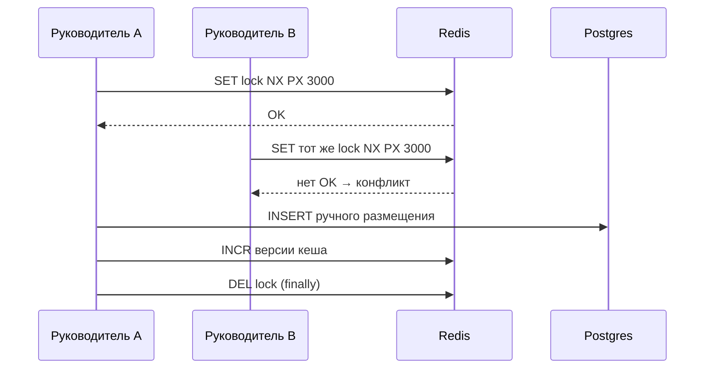
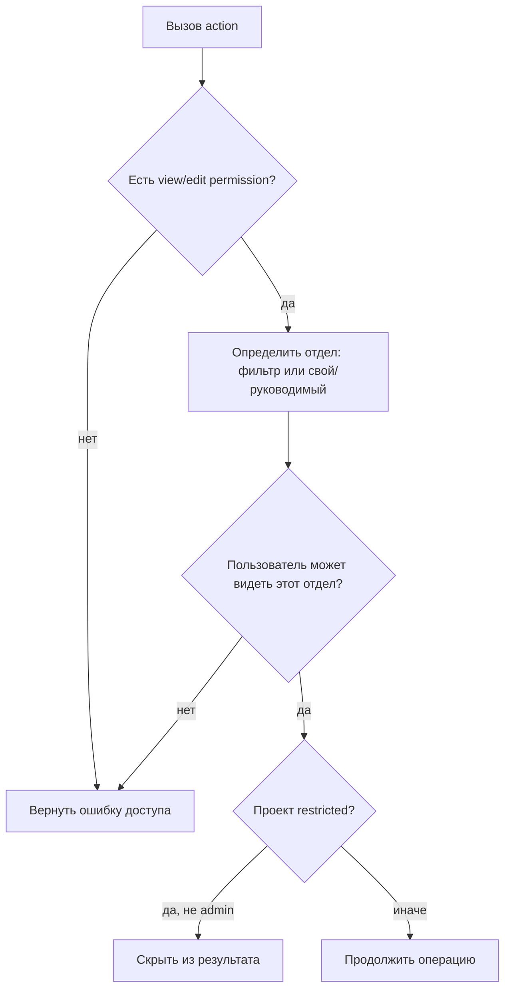
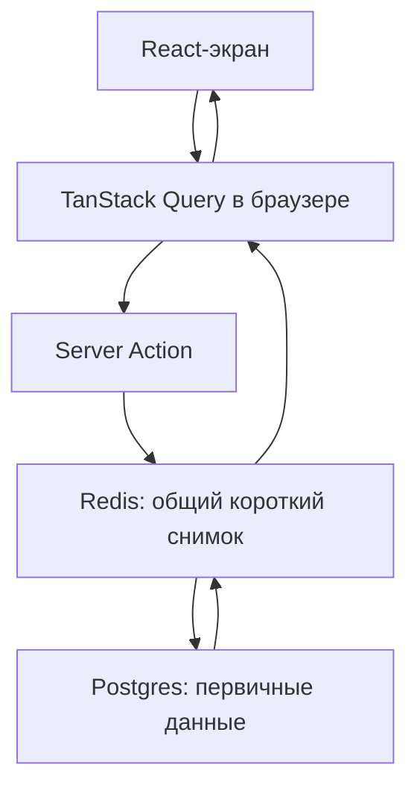

# Разбор текущей ветки: «Доска занятости» и Redis

> Состояние на 4 сентября 2026. Ветка `feature/employment-board` указывает на тот же коммит, что и `dev`; вся описанная ниже работа находится в **незакоммиченных** файлах. Это важно: до коммита или сохранения патча изменения могут потеряться.

## Коротко: что появилось

На странице `/tasks` появляется новый тип пользовательской вкладки — **«Занятость»**. Она показывает для одного отдела:

- карточки проектов;
- сотрудников под проектами;
- сотрудников без назначения;
- ручное закрепление проекта и ручное размещение сотрудника.

Это не новый планировщик. Реальные загрузки по-прежнему живут в Postgres-таблице `loadings`. Доска только показывает их и допускает дополнительную визуальную пометку «этот сотрудник сейчас на этом проекте».



## Две разные сущности: не путать

| Что | Где хранится | Меняет планирование? | Как убрать |
|---|---|---:|---|
| Автоматическое размещение | существующая `loadings` → `sections` → `projects` | Да | изменить/удалить загрузку в планировании |
| Ручное размещение | `department_board_placements` | Нет | убрать сотрудника с карточки |
| Закреплённый проект | `department_pinned_projects` | Нет | открепить карточку |
| Быстрый снимок доски | Redis | Нет, это копия | сам истечёт или станет неактуальным |



## Как собирается доска

Главная функция — `getDepartmentEmploymentBoard` в `modules/employment-board/actions/index.ts`.

1. Проверяет, что пользователь может видеть доску и выбранный отдел.
2. Берёт текущую версию кеша в Redis и пытается найти готовый снимок именно для этого пользователя/области прав.
3. При промахе одним параллельным блоком читает список сотрудников, ручные закрепления, ручные размещения и название отдела.
4. Выбирает активные **сегодня** записи `loadings` этих сотрудников, затем по `section_id` находит проекты.
5. Суммирует ставки одного сотрудника на одном проекте, добавляет ручные закрепления и ручные размещения. Если сотрудник уже попал туда по настоящей загрузке, ручная пометка не дублируется.
6. Сортирует проекты и сотрудников, вычисляет свободных людей, кладёт итоговый объект в Redis на 60 секунд и возвращает клиенту.



## Redis простыми словами

Redis — очень быстрый удалённый словарь «ключ → значение», который обычно держит данные в памяти. Он **не заменяет** Postgres: здесь Postgres остаётся источником истины, а Redis снижает число одинаковых тяжёлых чтений.

Используется `@upstash/redis`, то есть HTTP/REST-клиент к managed Upstash Redis. Это особенно удобно для serverless Next.js: вызов не держит постоянное TCP-подключение после завершения server action.

### Cache-aside — основной паттерн

Название буквально означает «кеш сбоку от базы». Приложение само решает, когда читать и записывать кеш.



Если Redis недоступен или переменные окружения отсутствуют, функции модуля не бросают исключение: чтение идёт сразу в Postgres, а запись продолжает работать. Цена — только медленнее ответ, не потеря данных.

### Какие ключи создаются

| Ключ | Пример | Назначение |
|---|---|---|
| версия доски | `employment-board:ver:<departmentId>` | счётчик актуальности отдела |
| снимок доски | `employment-board:v1:<dept>:a|u:<scopeHash>:v<N>` | готовый `EmploymentBoard`, TTL 60 секунд |
| лок размещения | `lock:placement:<dept>:<employee>` | короткий запрет на параллельное перетаскивание одного человека |

В ключе снимка есть `a`/`u` (админ/обычный пользователь) и `scopeHash` прав. Это критично: иначе пользователь без доступа мог бы увидеть закешированный ответ администратора.

### Почему используется счётчик версии, а не только `DEL`

Простая инвалидация выглядела бы как: после записи выполнить `DEL employment-board:<dept>`. Но существует гонка:



Реальный код читает версию **до** сборки, а любая запись делает `INCR` версии. Медленный читатель запишет устаревший ответ с `v7`, а следующий запрос уже ищет `v8`, поэтому `v7` никто не прочитает и он исчезнет по TTL.



### Distributed lock при переносе сотрудника

Перед `placeEmployee` вызывается атомарная Redis-команда `SET key 1 NX PX 3000`:

- `NX` — записать ключ, **только если его ещё нет**;
- `PX 3000` — автоматически удалить его через 3000 мс;
- если ключ уже есть, второй пользователь получает сообщение «Сотрудника уже перемещают».



TTL — страховка: если процесс упал и `finally` не выполнился, блокировка исчезнет максимум через 3 секунды. Redis-лок — дополнительная защита удобства пользователя; окончательная защита от дубля — уникальное ограничение Postgres `(department_id, project_id, employee_id)`.

Важно для дальнейшего развития: текущий `releaseLock` удаляет ключ без проверки «лок всё ещё мой». При очень медленной операции дольше 3 секунд теоретически возможна ситуация, когда первый запрос удалит лок, уже взятый вторым. Для строгого production-lock обычно кладут случайный токен и удаляют ключ Lua-скриптом только при совпадении токена. Для короткой операции в 3 секунды текущий вариант практичен, но это полезный следующий шаг для изучения.

## Что делает каждый изменённый или добавленный файл

### Новый модуль `modules/employment-board/`

| Файл | Роль простыми словами |
|---|---|
| `actions/index.ts` | Серверная «кухня»: проверяет права, читает Postgres/Redis, собирает доску, ищет проекты, создаёт и удаляет ручные записи. |
| `lib/redis.ts` | Единственное место общения с Upstash: создаёт клиент, читает/пишет снимок, повышает версию и управляет локом. |
| `hooks/useEmploymentBoard.ts` | Мост между React и server actions через TanStack Query. После любой мутации инвалидирует клиентский ключ доски, поэтому UI перечитает цельную свежую доску. |
| `hooks/useBoardDnd.ts` | Нативный HTML5 drag-and-drop: хранит, что тянут, и не даёт бросить сотрудника на фон или проект на карточку. `stopPropagation` нужен, чтобы событие карточки не было перехвачено фоном. |
| `components/EmploymentBoardInternal.tsx` | Корневой экран: загрузка/ошибка, заголовок, masonry-карточки, правая панель и связывание DnD с мутациями. |
| `components/ProjectCard.tsx` | Одна карточка проекта. Принимает только сотрудника, показывает число людей; позволяет снять лишь ручное размещение. |
| `components/EmployeeChip.tsx` | Маленькая плашка сотрудника с аватаром, именем и ставкой. Ручная плашка рисуется пунктиром; у неё есть кнопка удаления. |
| `components/SidePanel.tsx` | Правая панель. Дебаунсит поиск на 300 мс, по кнопке добавляет проект, показывает всех сотрудников и выделяет свободных. |
| `constants.ts` | Два строковых имени прав: `employment_board.view` и `employment_board.edit`; вынесены из server-файла, потому что `use server` разрешает экспортировать только async-функции. |
| `types/index.ts` | Контракты данных доски. Поле `source` различает настоящий loading и ручную пометку; `rate` есть только у loading. |
| `index.ts` | Публичный API модуля: другие части приложения импортируют компонент, права и типы отсюда, а не из внутренних путей. |
| `README.md` | Техническая документация модуля: модель данных, права, API, UI и Redis. |

### Изменения существующего приложения

| Файл | Что изменено |
|---|---|
| `modules/tasks/stores/tabs-store.ts` | В тип `TasksViewMode` и карту иконок добавлен режим `employment`. Без этого вкладку нельзя сохранить в Zustand-сторе. |
| `modules/tasks/components/TabModal.tsx` | В форме создания/редактирования вкладки появляется «Занятость», но только при праве просмотра. |
| `modules/tasks/components/TabPicker.tsx` | Добавлена иконка режима, чтобы сохранённая вкладка корректно отобразилась в выборе. |
| `modules/tasks/components/TasksTabs.tsx` | То же для верхней полосы уже открытых вкладок. |
| `modules/tasks/components/TasksView.tsx` | При `viewMode === 'employment'` монтирует `EmploymentBoardInternal` и передаёт фильтры. |
| `modules/cache/keys/query-keys.ts` | Добавляет стабильные TanStack Query-ключи: список доски по `department_id` и поиск по строке. Это клиентский кеш, отдельный от Redis. |
| `components/ui/user-avatar.tsx` | У изображения аватара `draggable={false}`. Иначе браузер при захвате аватара начал бы переносить URL картинки, а не чип сотрудника. |
| `types/db.ts` | Добавлены TypeScript-типы двух таблиц доски. Сам файл не создаёт таблицы — он лишь позволяет Supabase-клиенту типизированно с ними работать. |
| `next.config.mjs` | В dev отключает gzip для webpack-кеша, чтобы избежать падения из-за выделения большого непрерывного буфера памяти. К Redis не относится. |
| `package.json` | Добавляет библиотеку `@upstash/redis` версии `^1.38.3`. |
| `package-lock.json` | Фиксирует точное разрешённое дерево этой зависимости для воспроизводимой установки. Его вручную обычно не редактируют. |

### Файлы постановки и плана

| Файл | Назначение |
|---|---|
| `.devtool/features/feature-SB-07.md` | Карточка задачи: цель, принятые решения, чек-лист и ссылки на образцы кода. Её статус пока `todo`, хотя часть реализации уже написана. |
| `docs/employment-board-implementation-plan.md` | Исходный широкий план. В нём есть пункты второй итерации (rate limit, presence) и часть предполагаемой структуры, которые пока в код не вошли. |

## Что происходит при действиях пользователя

| Действие | Server action | Postgres | Redis | Клиент |
|---|---|---|---|---|
| Открыть доску | `getDepartmentEmploymentBoard` | только при cache miss | GET/SET на 15 с | получает собранную модель |
| Поиск | `searchBoardProjects` | `projects`, максимум 20 | не используется | строка дебаунсится 300 мс; Query кеширует поиск |
| Закрепить | `pinProject` | INSERT в `department_pinned_projects` | `INCR` версии | invalidates `employment-board` → повторное чтение |
| Открепить | `unpinProject` | DELETE pin | `INCR` версии | повторное чтение |
| Перенести человека | `placeEmployee` | INSERT в `department_board_placements` | lock, затем `INCR` | повторное чтение |
| Убрать человека | `removePlacement` | DELETE placement | `INCR` версии | повторное чтение |

## Проверка прав и видимости



Проверка на сервере важнее скрытой кнопки: клиент можно подменить, server action — нельзя. Для ручного размещения есть ещё одна проверка: человек должен состоять в выбранном отделе.

## Что ещё не завершено или требует проверки

Это не критика замысла, а границы того, что реально найдено в рабочем дереве.

1. **Нет SQL-миграции в репозитории.** В `types/db.ts` таблицы описаны, а в постановке сказано «миграция применена», но среди файлов не нашлось создания `department_pinned_projects` и `department_board_placements`, их уникальных ограничений, FK или RLS-политик. Значит миграция, вероятно, была применена вручную в удалённой БД и не сохранена здесь. Для воспроизводимости её стоит добавить в `supabase/migrations/`.
2. **Нет выдачи новых permissions в коде/миграциях.** Константы и проверки уже есть, но поиском не найдены записи/миграции для `employment_board.view` и `.edit`, а также назначение ролям. Пока этого нет в базе, не-админы вкладку не увидят.
3. **План и UI слегка расходятся.** План говорит о drag проекта из панели на фон. `useBoardDnd` умеет payload проекта, но `SidePanel` не создаёт перетаскиваемый список проектов: сейчас проект добавляется кнопкой `+` и сразу закрепляется. Это не ошибка текущего UX, но запланированный путь DnD не реализован.
4. **Rate limiting и presence отсутствуют.** В плановом документе они описаны как дальнейшая итерация; библиотека `@upstash/ratelimit` в фактические зависимости не добавлена.
5. **README неточно описывает restricted-проекты.** В нём упомянут `getRestrictedProjectIds()`, но реализация читает `projects.is_restricted` и фильтрует проекты прямо при сборке. Функционально это допустимый подход, но документацию полезно привести в соответствие коду.
6. **Redis ещё нужно сконфигурировать.** Без `UPSTASH_REDIS_REST_URL` и `UPSTASH_REDIS_REST_TOKEN` всё работает через Postgres. Для фактического изучения/использования кеша переменные нужно добавить локально и в окружение развёртывания; секретный token никогда не коммитить.

## Полезная ментальная модель «под капотом»

```text
Postgres = бухгалтерская книга: долговечные и правильные данные.
Redis    = быстрый листок-напоминание: его можно выкинуть и восстановить.
TanStack Query = память браузера: чтобы экран не запрашивал одно и то же каждый рендер.
Server Action = охранник и сборщик: проверяет доступ, решает, откуда взять данные,
                и только затем отдаёт их браузеру.
```

Поэтому здесь три уровня кеширования не дублируют друг друга:



## Перед ручной проверкой

- Убедиться, что обе таблицы и их RLS/unique constraints реально существуют в нужной Supabase-базе.
- Выдать `employment_board.view` и `employment_board.edit` тестовой роли.
- Добавить Upstash URL/token, если проверяется именно Redis; без них проверить fallback на Postgres.
- Создать сотруднику активную на сегодня загрузку и убедиться, что он появляется автоматически.
- Закрепить пустой проект, вручную поместить и убрать сотрудника; затем открыть доску вторым пользователем, чтобы проверить общий для отдела результат и отсутствие дубликатов.

## Техническая проверка рабочего дерева

`git diff --check` проходит: проблем с пробелами в отслеживаемых изменениях нет.

Полный `npx tsc --noEmit` сейчас не проходит из-за большого набора уже имеющихся ошибок в `_deleted/`, старых модулях, Sentry-типах и сгенерированном `.next/types`. Отдельная фильтрация вывода не показала ошибок, относящихся к `employment-board` или к изменённым файлам интеграции. Это не заменяет полноценный build после устранения общего долга типов.
