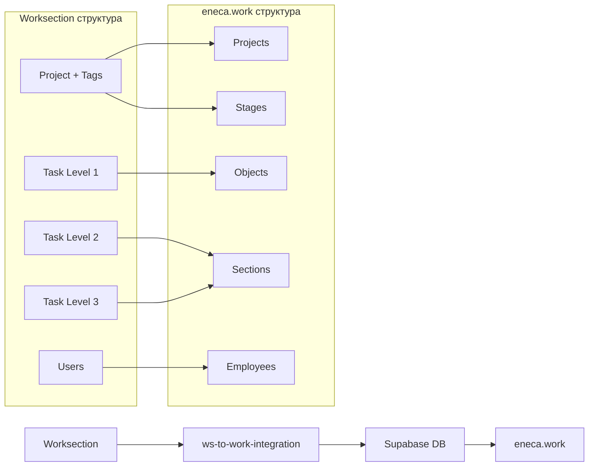

# 🔄 Документация системы синхронизации с Worksection

## 📖 Обзор системы

Приложение **ws-to-work-integration** представляет собой отдельный микросервис для односторонней синхронизации данных из Worksection в систему управления проектами **eneca.work**. Синхронизация происходит через API Worksection в базу данных Supabase PostgreSQL.

### 🎯 Назначение

Автоматическое преобразование иерархической структуры проектов и задач из Worksection в 5-уровневую систему управления проектами eneca.work:

```
Worksection          →    eneca.work
================     →    ==================
Project              →    Manager + Project
Task Level 1         →    Stage (Стадия)
Task Level 2         →    Object (Объект)
Task Level 3         →    Section (Раздел)
Users                →    Employees
```

### 🎲 Визуальная схема маппинга данных



## 🏗️ Архитектура интеграции

### Технический стек
- **Backend**: Node.js + Express.js
- **API интеграция**: Worksection REST API
- **База данных**: Supabase PostgreSQL
- **Веб-интерфейс**: Vanilla HTML/CSS/JS
- **Деплой**: Heroku (https://ws-to-work-integration-eneca-7cab192e5438.herokuapp.com/)
- **Локальная разработка**: localhost:3001

### Структура проекта
```
ws-to-work-integration/
├── src/app.js              # Основной сервер Express
├── functions/
│   ├── projects.js         # Логика синхронизации
│   ├── worksection-api.js  # API клиент Worksection
│   └── supabase-client.js  # API клиент Supabase
├── public/                 # Веб-интерфейс
└── docs/                   # Документация
```

## 🔄 Процесс синхронизации

### Этапы синхронизации (строгая последовательность)

#### 1️⃣ **Синхронизация проектов** (🏢 Projects)
**Источник**: Проекты Worksection с меткой `"eneca.work sync"`

**Маппинг данных**:
```javascript
Worksection Project → Supabase projects
{
  name                → project_name
  description         → project_description  
  id                  → external_id
  status              → project_status
  user_to.name        → manager_id (через поиск в profiles)
  "worksection"       → external_source
}
```

**Логика**:
- Получение всех проектов через API `get_projects` с параметром `extra: 'tags,users'`
- Фильтрация проектов по метке `"eneca.work sync"` (ID метки: 230964)
- Поиск менеджера проекта по полю `user_to` или первому администратору
- Создание новых проектов или обновление существующих по `external_id`

#### 2️⃣ **Синхронизация стадий** (🎯 Stages)
**Источник**: Метки (tags) проектов, содержащие слово "стадия"

**Маппинг данных**:
```javascript
Worksection Project Tag → Supabase stages
{
  tag.name            → stage_name
  tag.id              → external_id
  project.id          → stage_project_id (через связку)
  "worksection"       → external_source
}
```

**Логика**:
- Обработка меток каждого синхронизируемого проекта
- Поиск меток, содержащих "стадия" (регистронезависимо)
- Создание стадий в рамках соответствующего проекта
- Обновление названий существующих стадий при изменении

#### 3️⃣ **Синхронизация объектов** (📦 Objects)
**Источник**: Задачи Worksection первого уровня (родительские задачи)

**Маппинг данных**:
```javascript
Worksection Task Level 1 → Supabase objects
{
  title               → object_name
  text                → object_description
  id                  → external_id
  tags                → stage_id (поиск стадии по метке)
  user_to.name        → object_responsible_id
  status              → object_status
  date_start          → object_start_date
  date_finish         → object_end_date
}
```

**Логика**:
- Получение задач через API `get_tasks` для каждого проекта
- Фильтрация задач первого уровня (без родительских задач)
- Определение стадии через метки задачи
- Назначение ответственного через поиск пользователя
- Обработка статусов и дат

#### 4️⃣ **Синхронизация разделов** (📑 Sections)
**Источник**: Подзадачи Worksection (задачи второго и третьего уровней)

**Маппинг данных**:
```javascript
Worksection Subtask → Supabase sections
{
  title               → section_name
  text                → section_description
  id                  → external_id
  parent_task_id      → section_object_id (через связку)
  user_to.name        → section_responsible_id
  status              → section_status
  date_start          → section_start_date
  date_finish         → section_end_date
  priority            → section_priority
}
```

**Логика**:
- Рекурсивная обработка подзадач для каждого объекта
- Поддержка многоуровневой вложенности (Level 2 → Level 3)
- Определение родительского объекта через иерархию
- Управление статусами и приоритетами

## 🎛️ API Endpoints

### Основные API методы

| Endpoint | Метод | Описание |
|----------|-------|----------|
| `/api/sync/projects` | POST | Запуск полной синхронизации |
| `/api/projects/sync` | GET | Получение проектов с sync тегом |
| `/api/projects/tags` | GET | Получение всех тегов проектов |
| `/api/supabase/projects` | GET | Проекты из Supabase |
| `/api/health` | GET | Статус здоровья сервиса |
| `/api/stats` | GET | Статистика синхронизации |

### Полная синхронизация (`runFullSync`)

**Последовательность операций**:
1. **Этап 1/4**: Синхронизация проектов (`syncProjectsToSupabase`)
2. **Этап 2/4**: Синхронизация стадий (`syncStagesFromWorksection`)  
3. **Этап 3/4**: Синхронизация объектов (`syncObjectsFromWorksection`)
4. **Этап 4/4**: Синхронизация разделов (`syncSectionsFromWorksection`)

**Результат каждого этапа**:
```javascript
{
  success: boolean,
  created: Array,    // Созданные записи
  updated: Array,    // Обновленные записи
  unchanged: Array,  // Неизмененные записи
  errors: Array      // Ошибки обработки
}
```

## 🔧 Настройки и конфигурация

### Переменные окружения

```bash
# Supabase подключение
SUPABASE_URL=https://your-project.supabase.co
SUPABASE_SERVICE_ROLE_KEY=your-service-role-key

# Worksection API
WORKSECTION_DOMAIN=your-domain.worksection.com
WORKSECTION_HASH=your-api-hash

# Сервер
PORT=3001
HOST=localhost
```

### Критерии синхронизации

**Проекты для синхронизации**:
- Должны иметь метку `"eneca.work sync"` (ID: 230964)
- Активные или завершенные проекты
- С назначенным менеджером проекта

**Задачи для синхронизации**:
- Принадлежат синхронизируемым проектам
- Имеют назначенного исполнителя
- Содержат метки для определения стадий

## 🎯 Маппинг пользователей и ролей

### Поиск пользователей

**Алгоритм определения менеджера проекта**:
1. Поиск по полю `user_to` (основной менеджер)
2. Поиск среди участников с ролью `admin` или `manager`
3. Fallback на первого участника проекта
4. Сопоставление с базой eneca.work по имени и email

**Поиск ответственных за задачи**:
1. Извлечение `user_to` из задачи
2. Поиск в Supabase по полному имени
3. Поиск по email как fallback
4. Создание записи если пользователь не найден

## 📊 Логирование и мониторинг

### Структура логов

**Детальные логи операций**:
```
🚀 === НАЧАЛО ПОЛНОЙ СИНХРОНИЗАЦИИ ===
⏰ Время начала: 15.01.2024, 14:30:25

🏢 ЭТАП 1/4: Синхронизация проектов...
✅ Проекты: создано 2, обновлено 1, ошибок 0
  📝 Созданные проекты:
    + Новый проект (ID: proj_123)
  📝 Обновленные проекты:
    ↻ Существующий проект (ID: proj_456)

🎯 ЭТАП 2/4: Синхронизация стадий...
✅ Стадии: создано 5, обновлено 2, ошибок 0

📦 ЭТАП 3/4: Синхронизация объектов...
✅ Объекты: создано 12, обновлено 3, ошибок 0

📑 ЭТАП 4/4: Синхронизация разделов...
✅ Разделы: создано 28, обновлено 5, ошибок 1

🏁 === ЗАВЕРШЕНИЕ ПОЛНОЙ СИНХРОНИЗАЦИИ ===
⏱️ Общее время выполнения: 45.3 сек
✅ Всего создано: 47
🔄 Всего обновлено: 11
❌ Всего ошибок: 1
```

### Метрики производительности

**Отслеживаемые показатели**:
- Общее количество запросов
- Успешные/неуспешные операции
- Среднее время ответа
- Количество синхронизированных объектов
- Время работы сервиса

## 🚦 Состояния и статусы

### Маппинг статусов проектов

```javascript
Worksection → eneca.work
"active"    → "active"
"completed" → "archive"  
"paused"    → "paused"
"cancelled" → "canceled"
```

### Маппинг статусов задач

```javascript
Worksection → eneca.work
"new"       → "planning"
"active"    → "in_progress"
"completed" → "completed"
"paused"    → "paused"
"cancelled" → "canceled"
```

## 🛠️ Особенности реализации

### Идемпотентность операций

**Безопасный повторный запуск**:
- Проверка существования записей по `external_id`
- Обновление только измененных полей
- Сохранение связей между объектами
- Обработка удаленных записей в источнике

### Обработка ошибок

**Стратегия устойчивости**:
- Продолжение синхронизации при частичных ошибках
- Детальное логирование проблемных записей
- Откат изменений при критических ошибках
- Уведомления об ошибках в интерфейсе

### Оптимизация производительности

**Методы оптимизации**:
- Пакетная обработка записей
- Кэширование справочных данных
- Параллельная обработка независимых операций
- Ограничение частоты API запросов

## 🎨 Веб-интерфейс

### Функциональность

**Главная панель**:
- Кнопки запуска синхронизации по типам
- Кнопка полной автоматической синхронизации
- Отображение текущего статуса операций
- Детальные логи в реальном времени

**Информационные панели**:
- Статистика последней синхронизации
- Здоровье системы и метрики
- История операций
- Настройки и конфигурация

## 🔒 Безопасность

### Аутентификация и авторизация

**API ключи**:
- Service Role Key для Supabase (полный доступ к БД)
- Hash-ключ для Worksection API
- Переменные окружения для защиты credentials

**Сетевая безопасность**:
- CORS настройки для веб-интерфейса
- HTTPS для Heroku деплоя
- Валидация входящих данных

## 📈 Мониторинг и алерты

### Ключевые метрики

**Метрики надежности**:
- Успешность синхронизации (% успешных операций)
- Время выполнения полной синхронизации
- Количество ошибок за период
- Доступность внешних API

**Метрики бизнес-логики**:
- Количество синхронизируемых проектов
- Рост объема данных
- Частота изменений в источнике
- Производительность обработки

## 🔗 Интеграция с основным приложением eneca.work

### Настройка интеграции

**Переменные окружения в eneca.work**:
```bash
# .env.local (для разработки)
NEXT_PUBLIC_WS_INTEGRATION_URL=http://localhost:3001

# .env.production (для продакшена)  
NEXT_PUBLIC_WS_INTEGRATION_URL=https://ws-to-work-integration-eneca-7cab192e5438.herokuapp.com
```

### Использование в основном приложении

**Синхронизация данных**:
- Администраторы могут запустить синхронизацию через админ-панель
- Кнопка "Синхронизация с Worksection" в настройках системы
- Отображение статуса последней синхронизации
- Логи операций доступны в интерфейсе

**Индикация синхронизированных данных**:
- Проекты с `external_source: 'worksection'` помечаются как импортированные
- Поля `external_id` и `external_updated_at` для отслеживания источника
- Блокировка редактирования синхронизированных полей
- Возможность ручного изменения после импорта

### Жизненный цикл данных

**После синхронизации**:
1. Данные становятся частью системы eneca.work
2. Возможно ручное редактирование и дополнение
3. Повторная синхронизация обновляет только измененные поля
4. Удаленные в Worksection элементы остаются в eneca.work

**Конфликты при обновлении**:
- Приоритет у ручных изменений в eneca.work
- Синхронизация не перезаписывает локальные изменения
- Логирование конфликтов для ручного разрешения

## 📊 База данных eneca.work

### Структура таблиц для синхронизации

**Таблица `projects`**:
```sql
projects (
  project_id UUID PRIMARY KEY,
  project_name TEXT NOT NULL,
  project_description TEXT,
  manager_id UUID REFERENCES profiles(user_id),
  project_status TEXT DEFAULT 'active',
  external_id TEXT UNIQUE,           -- ID из Worksection
  external_source TEXT,              -- 'worksection'
  external_updated_at TIMESTAMPTZ,   -- Время последнего обновления
  created_at TIMESTAMPTZ DEFAULT NOW(),
  updated_at TIMESTAMPTZ DEFAULT NOW()
)
```

**Таблица `stages`**:
```sql
stages (
  stage_id UUID PRIMARY KEY,
  stage_name TEXT NOT NULL,
  stage_description TEXT,
  stage_project_id UUID REFERENCES projects(project_id),
  external_id TEXT UNIQUE,           -- ID метки из Worksection
  external_source TEXT,              -- 'worksection'
  external_updated_at TIMESTAMPTZ,
  created_at TIMESTAMPTZ DEFAULT NOW(),
  updated_at TIMESTAMPTZ DEFAULT NOW()
)
```

**Таблица `objects`**:
```sql
objects (
  object_id UUID PRIMARY KEY,
  object_name TEXT NOT NULL,
  object_description TEXT,
  stage_id UUID REFERENCES stages(stage_id),
  object_responsible_id UUID REFERENCES profiles(user_id),
  object_status TEXT DEFAULT 'planning',
  object_start_date DATE,
  object_end_date DATE,
  external_id TEXT UNIQUE,           -- ID задачи из Worksection
  external_source TEXT,              -- 'worksection'
  external_updated_at TIMESTAMPTZ,
  created_at TIMESTAMPTZ DEFAULT NOW(),
  updated_at TIMESTAMPTZ DEFAULT NOW()
)
```

**Таблица `sections`**:
```sql
sections (
  section_id UUID PRIMARY KEY,
  section_name TEXT NOT NULL,
  section_description TEXT,
  section_object_id UUID REFERENCES objects(object_id),
  section_responsible_id UUID REFERENCES profiles(user_id),
  section_status TEXT DEFAULT 'planning',
  section_start_date DATE,
  section_end_date DATE,
  section_priority INTEGER DEFAULT 1,
  external_id TEXT UNIQUE,           -- ID подзадачи из Worksection
  external_source TEXT,              -- 'worksection'
  external_updated_at TIMESTAMPTZ,
  created_at TIMESTAMPTZ DEFAULT NOW(),
  updated_at TIMESTAMPTZ DEFAULT NOW()
)
```

### Индексы для оптимизации

```sql
-- Быстрый поиск по external_id
CREATE INDEX idx_projects_external_id ON projects(external_id);
CREATE INDEX idx_stages_external_id ON stages(external_id);
CREATE INDEX idx_objects_external_id ON objects(external_id);
CREATE INDEX idx_sections_external_id ON sections(external_id);

-- Фильтрация по источнику данных
CREATE INDEX idx_projects_external_source ON projects(external_source);
CREATE INDEX idx_stages_external_source ON stages(external_source);
CREATE INDEX idx_objects_external_source ON objects(external_source);
CREATE INDEX idx_sections_external_source ON sections(external_source);
```

## 🔄 Процесс развертывания

### Heroku деплой

**Автоматический деплой**:
```bash
# Подключение к Heroku
heroku git:remote -a ws-to-work-integration-eneca

# Деплой изменений
git push heroku main

# Просмотр логов
heroku logs --tail -a ws-to-work-integration-eneca
```

**Переменные окружения Heroku**:
```bash
heroku config:set SUPABASE_URL=... -a ws-to-work-integration-eneca
heroku config:set SUPABASE_SERVICE_ROLE_KEY=... -a ws-to-work-integration-eneca
heroku config:set WORKSECTION_DOMAIN=... -a ws-to-work-integration-eneca
heroku config:set WORKSECTION_HASH=... -a ws-to-work-integration-eneca
```

### Локальная разработка

**Запуск интеграции локально**:
```bash
cd ws-to-work-integration
npm install
npm run dev
# Сервер доступен на http://localhost:3001
```

**Запуск основного приложения**:
```bash
cd eneca.work
# NEXT_PUBLIC_WS_INTEGRATION_URL=http://localhost:3001 в .env.local
npm run dev
# Приложение доступно на http://localhost:3000
```

## 📋 Краткая сводка

### ✨ Что делает система

**ws-to-work-integration** - это отдельное приложение (микросервис), которое:

1. **Подключается к Worksection API** и получает проекты с меткой "eneca.work sync"
2. **Преобразует структуру данных** из плоской структуры Worksection в иерархическую 5-уровневую систему eneca.work
3. **Синхронизирует в 4 этапа**:
   - Проекты → Менеджеры/Проекты
   - Метки проектов → Стадии  
   - Задачи L1 → Объекты
   - Подзадачи L2-3 → Разделы
4. **Сохраняет в Supabase** PostgreSQL базу данных
5. **Интегрируется с eneca.work** через переменную окружения NEXT_PUBLIC_WS_INTEGRATION_URL

### 🚀 Как запустить синхронизацию

**Автоматически** (рекомендуется):
- Открыть https://ws-to-work-integration-eneca-7cab192e5438.herokuapp.com/
- Нажать кнопку "🚀 Полная синхронизация"
- Дождаться завершения всех 4 этапов

**Вручную по этапам**:
1. 🏢 Синхронизация проектов
2. 🎯 Синхронизация стадий  
3. 📦 Синхронизация объектов
4. 📑 Синхронизация разделов

### 📊 Что происходит с данными

- **Источник**: Worksection проекты с меткой "eneca.work sync"
- **Назначение**: 5-уровневая иерархия в eneca.work (Manager→Project→Stage→Object→Section)
- **Тип синхронизации**: Односторонняя (только Worksection → eneca.work)
- **Безопасность**: Идемпотентные операции, можно запускать многократно
- **Обновления**: Только измененные данные, локальные изменения сохраняются

### 🔧 Техническая архитектура

- **Приложение**: Node.js + Express.js на порту 3001 (Heroku) 
- **API интеграция**: Worksection REST API + Supabase PostgreSQL API
- **Веб-интерфейс**: HTML/CSS/JS для управления синхронизацией
- **Развертывание**: Heroku + переменные окружения
- **Мониторинг**: Детальные логи + статистика операций

## 🎯 Заключение

Система синхронизации **ws-to-work-integration** обеспечивает надежную одностороннюю интеграцию между Worksection и eneca.work, автоматически преобразуя структуру проектов и задач в 5-уровневую систему управления проектами. Ключевые преимущества:

✅ **Автоматизация**: Полная синхронизация одним кликом  
✅ **Надежность**: Идемпотентные операции и обработка ошибок  
✅ **Прозрачность**: Детальное логирование всех операций  
✅ **Гибкость**: Поддержка частичной и полной синхронизации  
✅ **Масштабируемость**: Готовность к росту объемов данных  
✅ **Интеграция**: Бесшовная работа с основным приложением  
✅ **Мониторинг**: Полная наблюдаемость процесса синхронизации 