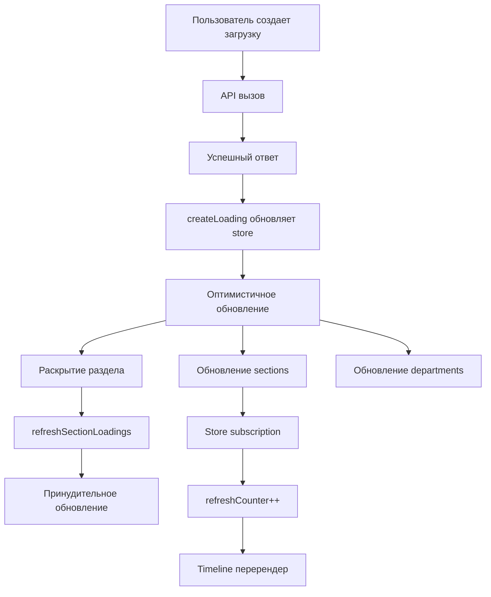

# Автоматическое обновление Timeline при создании загрузок

## Обзор

Реализован механизм автоматического обновления Timeline Grid при создании новых загрузок пользователем. Система обеспечивает мгновенное отображение новых загрузок без необходимости ручной перезагрузки страницы.

## Ключевые улучшения

### 1. Оптимистичные обновления в `createLoading`

**Файл:** `modules/planning/stores/usePlanningStore.ts`

- ✅ Локальное состояние обновляется сразу после успешного API вызова
- ✅ Автоматическое раскрытие раздела для показа новой загрузки
- ✅ Обновление загрузок в `sections`, `allSections` и `loadingsMap`
- ✅ Обновление загрузок сотрудников в отделах с пересчетом `dailyWorkloads`
- ✅ Проверка на дубликаты для предотвращения повторных записей

### 1.1. Обновления в операциях с загрузками

Аналогичные улучшения добавлены во все операции с загрузками:

**`updateLoading`** - Обновление загрузки:
- ✅ Пересчет `dailyWorkloads` для сотрудников
- ✅ Обновление всех связанных состояний
- ✅ Поддержка перемещения между разделами

**`deleteLoading`** - Удаление загрузки:
- ✅ Полное удаление из всех состояний
- ✅ Пересчет `dailyWorkloads` после удаления
- ✅ Обновление счетчиков `hasLoadings` и `loadingsCount`

**`archiveLoading`** - Архивирование загрузки:
- ✅ Удаление из активных данных
- ✅ Пересчет метрик сотрудников
- ✅ Синхронизация между разделами и отделами

**`restoreLoading`** - Восстановление из архива:
- ✅ Полная перезагрузка данных через `fetchSections()`
- ✅ Обновление отделов при необходимости

### 2. Функция `refreshSectionLoadings`

**Файл:** `modules/planning/stores/usePlanningStore.ts`

Новая функция для принудительного обновления конкретного раздела:

```typescript
refreshSectionLoadings: async (sectionId: string) => Promise<{ success: boolean; error?: string }>
```

- Загружает свежие данные для конкретного раздела через `fetchSectionLoadings`
- Обновляет карту загрузок
- Синхронизирует `sections` и `allSections`

**Исправление:** Функция теперь корректно использует `fetchSectionLoadings` вместо несуществующей `getSectionLoadings`.

### 3. Дополнительные вызовы в модальных окнах

**Файлы:**
- `modules/planning/components/timeline/add-loading-modal.tsx`
- `modules/planning/components/timeline/create-loading-by-section-modal.tsx`

После успешного создания загрузки вызывается `refreshSectionLoadings` для гарантии отображения.

### 4. Реактивное обновление в Timeline View

**Файл:** `modules/planning/components/timeline-view.tsx`

- ✅ Подписка на изменения в store через `usePlanningStore.subscribe`
- ✅ Счетчик `refreshCounter` для принудительного обновления компонента
- ✅ Использование `key` в TimelineGrid для форсирования перерендера

### 5. Хук `useTimelineAutoRefresh`

**Файл:** `modules/planning/hooks/useTimelineAutoRefresh.ts`

Автоматическое отслеживание изменений в разделах и загрузках:
- Сравнение предыдущего и текущего состояния
- Логирование новых загрузок
- Возможность принудительного обновления

## Техническая архитектура



## Последовательность обновлений

1. **Создание загрузки** → API вызов
2. **Успешный ответ** → Оптимистичное обновление store
3. **Локальное состояние** → Обновление sections, allSections, loadingsMap, departments
4. **Автоматическое раскрытие** → toggleSectionExpanded(sectionId)
5. **Дополнительная гарантия** → refreshSectionLoadings(sectionId)
6. **Реактивность** → Store subscription → refreshCounter → Timeline key change
7. **Результат** → Мгновенное отображение новой загрузки

## Преимущества

1. **UX**: Мгновенная обратная связь пользователю
2. **Надежность**: Двойная проверка через оптимистичное обновление + принудительное обновление
3. **Производительность**: Минимальные изменения в состоянии, только затронутые разделы
4. **Консистентность**: Синхронизация между разделами и отделами
5. **Отладка**: Подробное логирование всех операций

## Мониторинг

Система логирует следующие события:
- ✅ Создание загрузки с деталями
- 🔄 Обновление разделов
- 🆕 Обнаружение новых загрузок
- 📊 Количество загрузок в разделах

## Конфигурация

Никаких дополнительных настроек не требуется. Система работает автоматически при любом создании загрузки через существующие модальные окна.

## История изменений и исправления

### v1.1 - Исправления ошибок и расширение функциональности

**Исправлены критические ошибки:**

1. 🐛 `TypeError: get(...).getSectionLoadings is not a function`
   - ✅ Заменено на корректный вызов `get().fetchSectionLoadings(sectionId)`

2. 🐛 `Error: Ошибка при загрузке активных загрузок: {}`
   - ✅ Исправлен запрос в `fetchLoadings()` - переключение с `active_loadings` на `view_sections_with_loadings`
   - ✅ Корректное получение полей `responsible_first_name`, `responsible_last_name`, `responsible_avatar`
   - ✅ Улучшена обработка ошибок с детальным логированием
   - ✅ Добавлена проверка типов возвращаемых данных в `fetchSectionLoadings()`

**Добавлена поддержка всех операций с загрузками:**
- ✅ **Удаление загрузки** - мгновенное обновление UI с пересчетом метрик
- ✅ **Архивирование загрузки** - корректное удаление из активных данных
- ✅ **Обновление загрузки** - реактивное обновление с поддержкой перемещения между разделами
- ✅ **Восстановление из архива** - полная перезагрузка данных

**Улучшения производительности:**
- ✅ Добавлен пересчет `dailyWorkloads` для всех операций
- ✅ Обновление счетчиков `hasLoadings` и `loadingsCount`
- ✅ Подробное логирование всех операций для отладки
- ✅ Консистентность данных между разделами и отделами

3. 🐛 `Раздел сворачивается при перерендере`
   - ✅ Убран принудительный `key` перерендер в TimelineGrid
   - ✅ Добавлен `refreshCounter` как обычный проп вместо `key`
   - ✅ Улучшена подписка на изменения - только при реальных изменениях данных
   - ✅ Состояние раскрытых разделов теперь сохраняется при обновлениях

Система теперь обеспечивает полную реактивность для всех операций с загрузками в Timeline Grid без потери состояния UI.